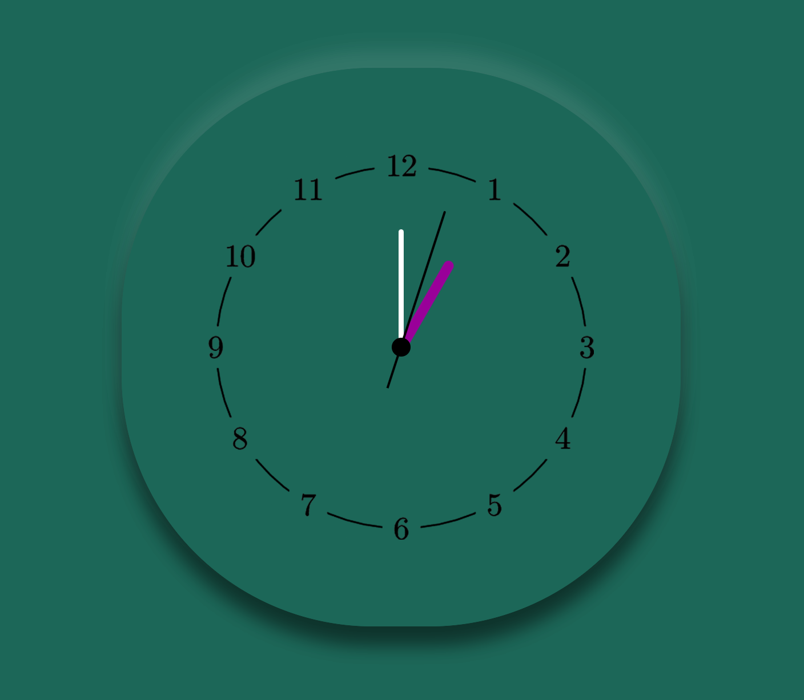
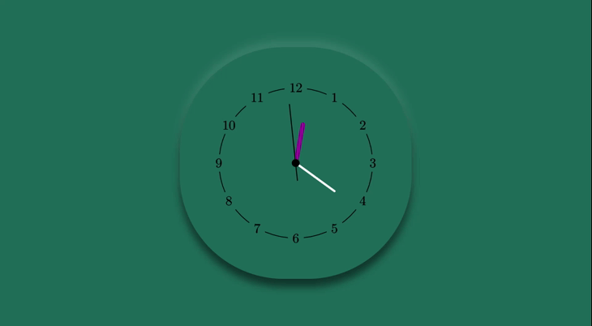

# Minimalist-HMTL-CSS-Clock
[](https://www.javascript.com/)
[](https://opensource.org/licenses/MIT)

[](https://app.netlify.com/sites/minimalist-clock-site/deploys)

## Description 

This is a simple clock application that shows the current time. Users can use this clock to see the time in the central standard time zone.
## Table of Contents

* [Technologies Used](#technologies-used)
* [Deployed Link](#deployed-link)
* [Application Images](#application-images)
* [Contributing](#contributing)
* [Tests](#tests)
* [Questions](#questions)
* [License](#license)

## Technologies Used
* HTML
* CSS
* JavaScript

## Deployed Link

* This application is hosted on the netlify environment: [Minimalist Clock Site](https://minimalist-clock-site.netlify.app/)
* This is the repository link for this application: [Minimalist Clock Site Repository](https://github.com/JoyUmoekpo/Minimalist-HMTL-CSS-Clock)

## Application Image(s) 



## Contributing

* I am the sole author of this project and anyone can contribute by contacting me.
## Tests

* There are no tests for this project.

## Questions

If you have any questions, feel free to contact me by using the information listed below:

* Github: https://github.com/joyumoekpo
* Email: joyumoekpo1@gmail.com

## License

### MIT License

```
Copyright (c) [*2022] JoyUmoekpo

Permission is hereby granted, free of charge, to any person obtaining a copy
of this software and associated documentation files (the "Software"), to deal
in the Software without restriction, including without limitation the rights
to use, copy, modify, merge, publish, distribute, sublicense, and/or sell
copies of the Software, and to permit persons to whom the Software is
furnished to do so, subject to the following conditions:

The above copyright notice and this permission notice shall be included in all
copies or substantial portions of the Software.

THE SOFTWARE IS PROVIDED "AS IS", WITHOUT WARRANTY OF ANY KIND, EXPRESS OR
IMPLIED, INCLUDING BUT NOT LIMITED TO THE WARRANTIES OF MERCHANTABILITY,
FITNESS FOR A PARTICULAR PURPOSE AND NONINFRINGEMENT. IN NO EVENT SHALL THE
AUTHORS OR COPYRIGHT HOLDERS BE LIABLE FOR ANY CLAIM, DAMAGES OR OTHER
LIABILITY, WHETHER IN AN ACTION OF CONTRACT, TORT OR OTHERWISE, ARISING FROM,
OUT OF OR IN CONNECTION WITH THE SOFTWARE OR THE USE OR OTHER DEALINGS IN THE
SOFTWARE.
```